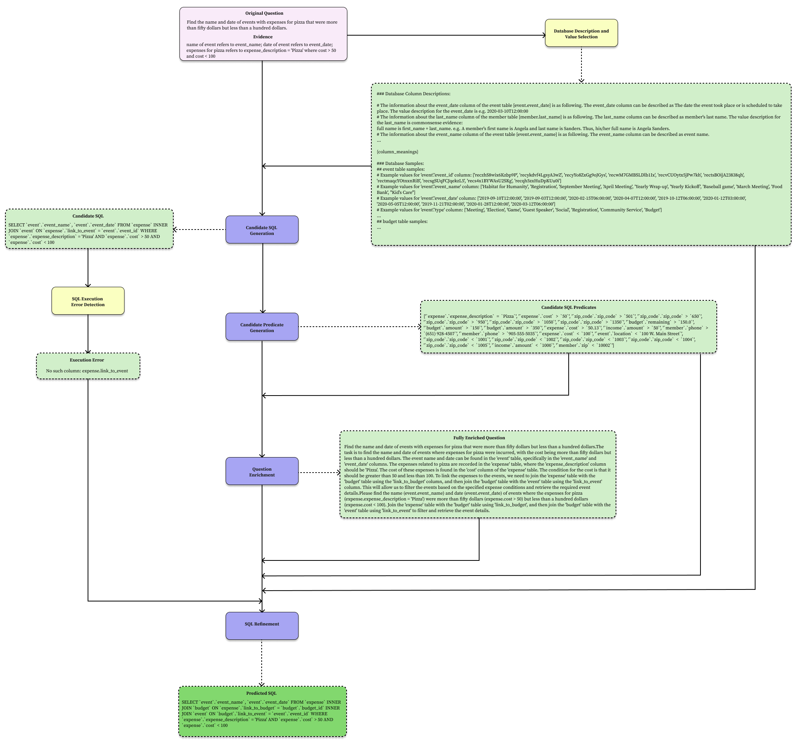

# E-SQL: Direct Schema Linking via Question Enrichment in Text-to-SQL

This is the official repository for the paper **"E-SQL: Direct Schema Linking via Question Enrichment in Text-to-SQL"**.

## Overview

Translating natural language queries into SQL (Text-to-SQL) is a critical task for enabling natural language interfaces to databases (NLIDB), but challenges such as complex schemas and ambiguous queries often hinder the accuracy of generated SQL. **E-SQL** addresses these challenges through a novel pipeline that directly links relevant database schema items with the natural language query, a method we call **Question Enrichment**.

E-SQL enriches natural language questions by incorporating relevant database elements—such as tables, columns, and potential conditions—directly into the query to enhance SQL generation accuracy. Our pipeline also introduces **Candidate Predicate Generation** to further reduce SQL errors caused by incomplete or incorrect predicates.

 <br />

### Key modules of the E-SQL pipeline:
- **Candidate SQL Generation (CSG)**: Generates initial SQL queries based on the natural language question.
- **Candidate Predicate Generation (CPG)**: Extracts and incorporates likely predicates from the database.
- **Question Enrichment (QE)**: Enhances the natural language query by linking relevant database items and conditions.
- **SQL Refinement (SR)**: Refines generated SQL queries by correcting minor errors and ensuring execution correctness.

While schema filtering has been widely adopted in previous research, our experiments show that it can lead to performance degradation when used alongside advanced large language models (LLMs). Instead, direct schema linking through question enrichment and candidate predicate augmentation proves to be more effective, particularly on complex queries.


E-SQL execution flow for th question with question ID 1448 in the development set is given below.
 <br />

This repository contains all the code for implementing and evaluating **E-SQL** on the BIRD development set, utilizing models like GPT-4 and GPT-4o-mini to achieve competitive performance. 


## Project Structure
To avoid any potential file path errors, organize your project files as follows: 

    ```text
    nlq-to-sql/
    ├── dataset/
    │   ├── bird-sql/
    │   │   ├── dev/
    |   |   |   ├── dev_databases/
    |   |   |   ├── column_meaning.json 
    |   |   |   ├── dev_gold.json 
    |   |   |   ├── dev_tables.json 
    |   |   |   ├── dev_tied_append.json 
    |   |   |   ├── dev.json 
    │   │   ├── test/
    |   |   |   ├── test_databases/
    |   |   |   ├── column_meaning.json 
    |   |   |   ├── test_gold.json 
    |   |   |   ├── test_tables.json 
    |   |   |   ├── test.json 
    ├── E-SQL/
    │   ├── evaluation/
    │   │   ├── evaluation_ves.py
    │   │   └── evaluation.py
    │   ├── few-shot-data/
    │   │   └── question_enrichment_few_shot_examples.json
    │   ├── pipeline/
    │   │   └── Pipeline.py
    │   ├── prompt_templates/
    │   │   ├── candidate_sql_generation_prompt_template.txt
    │   │   ├── question_enrichment_prompt_template.txt
    │   │   └── sql_refinement_prompt_template.txt
    │   ├── results/
    │   │   ├── model_outputs_dev_CSG-EQ-SR_gpt-4o-2024-08-06/
    │   │   ├── model_outputs_dev_CSG-EQ-SR_gpt-4o-mini-2024-07-18/
    │   ├── utils/
    │   │   ├── __init__.py
    │   │   ├── db_utils.py
    │   │   ├── openai_utils.py
    │   │   ├── prompt_utils.py
    │   │   └── retrieval_utils.py
    │   ├── .env
    │   ├── .gitignore
    │   ├── env.example
    │   ├── main.py
    │   ├── README.md
    │   ├── requirements.txt
    │   ├── run_evaluation.sh
    │   ├── run_main.sh
   
    ```


## Setting up the Environment
1. **Download the compressed code.**
2. **Create a `.env` file and set environment variable as follows:** In the root directory of the E-SQL add the following items to the `.env` file. Ensure that your environment variables are correctly configured. One critical point is to set the DB_ROOT_PATH environment variable to the root directory of the bird-dataset, which contains both the dev and test directories. This is critical for the proper functioning of the code, as the database paths are dynamically constructed based on the mode (dev or test). To avoid any potential file path errors, we strongly recommend organizing your project files as we described above.

    ```
    DB_ROOT_PATH="../dataset/bird-sql"
    OPENAI_API_KEY=<your OpenAI Key>
    ```

3. **Install the required packages:** Use the following command to install the required packages:
    ```
    pip install -r requirements.txt
    ```


## Running the Code
1. **Update the `run_main.sh` file for running mode or OpenAI model change:** In `run_main.sh` file set the mode and model argument. Do not change the other arguments in the `run_main.sh`.

    ```bash
    mode='test'  # Update this with the mode you want to run. Write either 'dev' or 'test'
    model="gpt-4o-2024-08-06"  # For GPT-4o use "gpt-4o-2024-08-06". For GPT-4o-mini use "gpt-4o-mini-2024-07-18".
    pipeline_order="CSG-QE-SR" 
    ...
    ```

   

2. **Run the main script:** After move to the E-SQL directory run the main script as follows. Running main script initially process all database csv files that include description about tables and column of databases.
    ```
    cd E-SQL
    sh run_main.sh
    ```

3. Review Informative Logs: After running the main script, the database description files will be processed, and informative logs will be printed. These logs provide detailed information about the processing steps and the status of each database description file. No additional effort is required during this step; it is intended for informational purposes only to help you monitor the process.


## Evaluation 

1. **Setting up the Evaluation Arguments:** In order to evaluate the results, set the arguments in the `run_evaluation.sh` as follows:

    ```bash
    db_root_path='../dataset/bird-sql/dev/dev_databases/' 
    data_mode='dev' 
    diff_json_path='../dataset/bird-sql/dev/dev.json' 
    predicted_sql_path_kg='./results/model_outputs_{args.mode}_{args.pipeline_order}_{args.model}'
    ground_truth_path='../dataset/bird-sql/dev/'
    num_cpus=8
    meta_time_out=30.0
    mode_gt='gt'
    mode_predict='gpt'
    ```


2. **Run the evaluation script** after main script is executed and all predicted SQLs are saved into the `predict_dev.json` or `predict_test.json` files under `./results/model_outputs_{args.mode}_{args.pipeline_order}_{args.model}` directory. Please run the evaluation script as follows to print both EX and VES metrics after completed the previous step.
    ```
    sh run_evaluation.sh
    ```

3. **Cost estimation**: The evaluation on the dev set involves approximately 40.25 million prompt tokens and 1.23 million output tokens, resulting in an estimated cost of $112 for GPT-4o and $8 for GPT-4o-mini.

## Metrics

Finally the `metric.json` file under the `./results/model_outputs` directory is created to inspect the execution accuracies. The `metric.json` file format is as followings. Note that this file doesn't include VES metric. You can also run the evaluation script as explained in the previous part.

    ```json
       "candidate_generation": {
            "EX": "Overall Execution Accuracy",
            "total_correct_count": "Total number of correctly predicted SQLs.",
            "total_item_count": "Total item count",
            "simple_stats": {
                "correct_number": "The number of correctly predicted SQL considered as simple.",
                "count": "The total number of simple questions.",
                "ex": "Execution accuracy for the simple questions."
            },
            "moderate_stats": {
                "correct_number": "The number of correctly predicted SQL considered as moderate.",
                "count": "The total number of moderate questions.",
                "ex": "Execution accuracy for the moderate questions."
            },
            "challenging_stats": {
                "correct_number": "The number of correctly predicted SQL considered as challenging.",
                "count": "The total number of challenging questions.",
                "ex": "Execution accuracy for the challenging questions."
            },
            "fail_q_ids": [],
            "config": {
                "mode": "Either dev or test",
                "model": "OpenAI model",
                "temperature": 0.0,
                "top_p": 1.0,
                "max_tokens": 2048,
                "n": 1,
                "pipeline_order": "Selected Pipeline Order",
                "enrichment_level": "complex",
                "enrichment_level_shot_number": 3,
                "enrichment_few_shot_schema_existance": false,
                "filtering_level_shot_number": 3,
                "filtering_few_shot_schema_existance": false,
                "cfg": true,
                "generation_level_shot_number": 3,
                "generation_few_shot_schema_existance": false,
                "db_sample_limit": 10,
                "relevant_description_number": 20,
                "seed": 42
            } 
       }
    ```

## Additional Notes:

1. **Column Meaning File Usage**: The `column_meaning.json` file is needed in both dev and test.

2. **Error Handling**: There are error-handling mechanisms and loggings. However, in some cases, the LLM might fail to generate a SQL query, causing an error that halts the code execution. When such an error occurs, the question ID where the code stopped can be viewed both in the terminal and in the predictions.json or predict_dev.json files, located in the results/model_outputs_{mode}_{pipeline_order}_{model} directory. When restarting the evaluation, locate the error point, then open the main.py file. You'll find a section labeled "In case of an error, you can restart the code from the point of error using the following line." Update the dataset list accordingly so that the code resumes from where it left off, preventing the need to start the process over from the beginning. Although the code appends new predicted SQLs and corresponding objects to the `predict_dev.json` and `predictions.json` files, please make a copy of both files with a different name in case of an error, to ensure that previously generated data is not lost.

3. **SQL Parsing**: The generated SQL queries are parsed using the SQLGlot SQL parser. While parsing, errors may arise, but these are handled using try-except statements. Although warnings are logged when parsing issues occur, these can generally be ignored as long as no errors are thrown and the execution proceeds smoothly.

4. **Gold SQL File Naming**: The evaluation script expects a file named dev_gold.sql. However, the corresponding file downloaded from BIRD website was named dev.sql. To ensure compatibility with the evaluation script, copy and rename the dev.sql file to dev_gold.sql. 


# Citation

If you find this repository helpful, please cite the following paper:

```
@misc{caferoğlu2024esqldirectschemalinking,
      title={E-SQL: Direct Schema Linking via Question Enrichment in Text-to-SQL}, 
      author={Hasan Alp Caferoğlu and Özgür Ulusoy},
      year={2024},
      eprint={2409.16751},
      archivePrefix={arXiv},
      primaryClass={cs.CL},
      url={https://arxiv.org/abs/2409.16751}, 
}
```